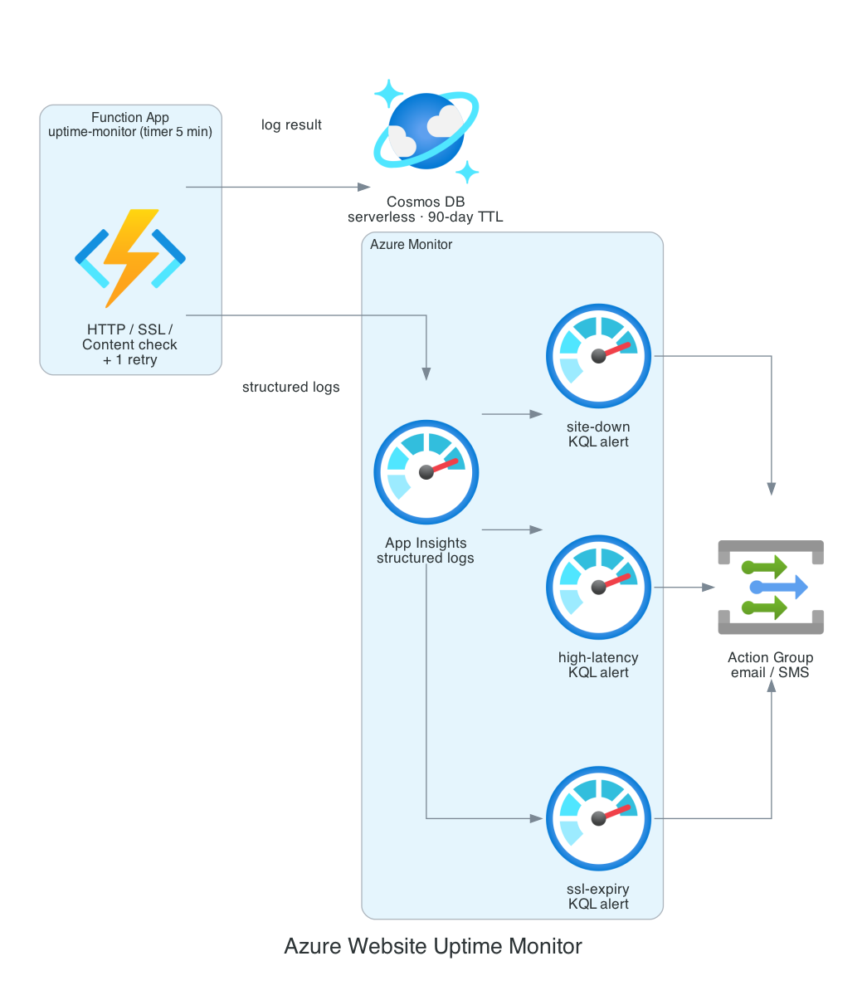

# Azure Website Uptime Monitor

The Azure counterpart to [website-uptime-monitor](https://github.com/jordann6/website-uptime-monitor). Serverless uptime monitoring for [jordandesigns.io](https://jordandesigns.io) using a timer-triggered Azure Function, Cosmos DB, Application Insights, Azure Monitor, and an action group.

## Architecture



A timer-triggered Function runs every 5 minutes. It performs three checks against the target URL, HTTP status, response body content, and SSL certificate expiry, with one automatic retry before recording a failure to suppress transient false positives. Each result is written to Cosmos DB with a 90-day TTL and logged to Application Insights. KQL scheduled-query alerts run over those logs (site-down on two consecutive failures, high-latency on sustained slow responses, and SSL-expiry within 7 days) and route to an action group that delivers email and SMS.

## Service Mapping (AWS -> Azure)

| AWS build | This build |
|---|---|
| Lambda (Python) | Azure Functions (Python 3.11, Flex Consumption) |
| EventBridge `rate(5 min)` | Timer trigger `0 */5 * * * *` |
| DynamoDB + TTL | Cosmos DB serverless (SQL API) + container TTL |
| CloudWatch custom metrics | Application Insights structured logs |
| CloudWatch alarms | Azure Monitor KQL scheduled-query alerts |
| CloudWatch dashboard | Application Insights workbook |
| SNS email/SMS | Action group email/SMS receivers |
| IAM least-privilege role | Managed identity + Cosmos data-plane RBAC |
| S3 state backend | azurerm backend (Storage account) |

## Resources

| Resource | Detail |
|---|---|
| Function App | Python 3.11, Flex Consumption (FC1), timer trigger every 5 min |
| Cosmos DB | Serverless SQL API, partition key `/check_id`, 90-day container TTL |
| Application Insights | Structured `uptime_result` logs per check |
| KQL Alerts | `site-down` (2 consecutive failures), `high-latency` (avg > 3s), `ssl-expiry` (<= 7 days) |
| Action Group | Email + optional SMS |
| Workbook | Health, latency, SSL-days timecharts |
| Managed Identity | Cosmos DB Built-in Data Contributor (no keys) |

## Checks

1. **HTTP status** — 2xx/3xx = healthy, anything else fails the check
2. **Content check** — optional substring verified in the response body (`content_check` var)
3. **SSL expiry** — surfaced as `ssl_days_remaining`; alert fires at 7 days

## Deploy

```bash
az login

cd terraform
terraform init
terraform apply

# Then deploy the function code (CI does this automatically on push to main):
func azure functionapp publish "$(terraform output -raw function_app_name)" --python
```

## Variables

| Variable | Default | Description |
|---|---|---|
| `check_url` | `https://jordandesigns.io` | URL to monitor |
| `content_check` | `""` | Substring to verify in the response body (optional) |
| `alert_email` | `jordandn6@outlook.com` | Email for alerts |
| `alert_sms` | `""` | Phone number for SMS alerts (optional) |
| `latency_threshold_ms` | `3000` | Average latency that trips the high-latency alert |
| `location` | `eastus2` | Azure region |

## CI/CD

GitHub Actions (`.github/workflows/deploy.yml`) lints the function with Ruff, scans dependencies with pip-audit, and runs `terraform fmt/validate/plan` on every push, all via OIDC. The apply-and-deploy job is gated behind a manual `workflow_dispatch` trigger so the deploy/demo/destroy lifecycle stays under your control. Required secrets: `AZURE_CLIENT_ID`, `AZURE_TENANT_ID`, `AZURE_SUBSCRIPTION_ID`.

## Tech Stack

- **Python 3.11** (stdlib HTTP/SSL checks) — Function App runtime
- **azure-cosmos / azure-identity** — result logging via managed identity
- **Terraform `>= 1.6`** · `azurerm ~> 3.100` — all infrastructure as code
- **Azure Monitor** — KQL scheduled-query alerts, action group
- **Application Insights** — structured logs + workbook
- **GitHub Actions** — OIDC auth, Ruff, pip-audit, terraform, function deploy
